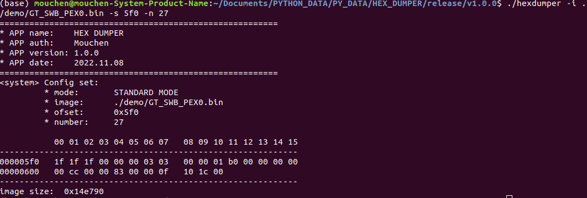
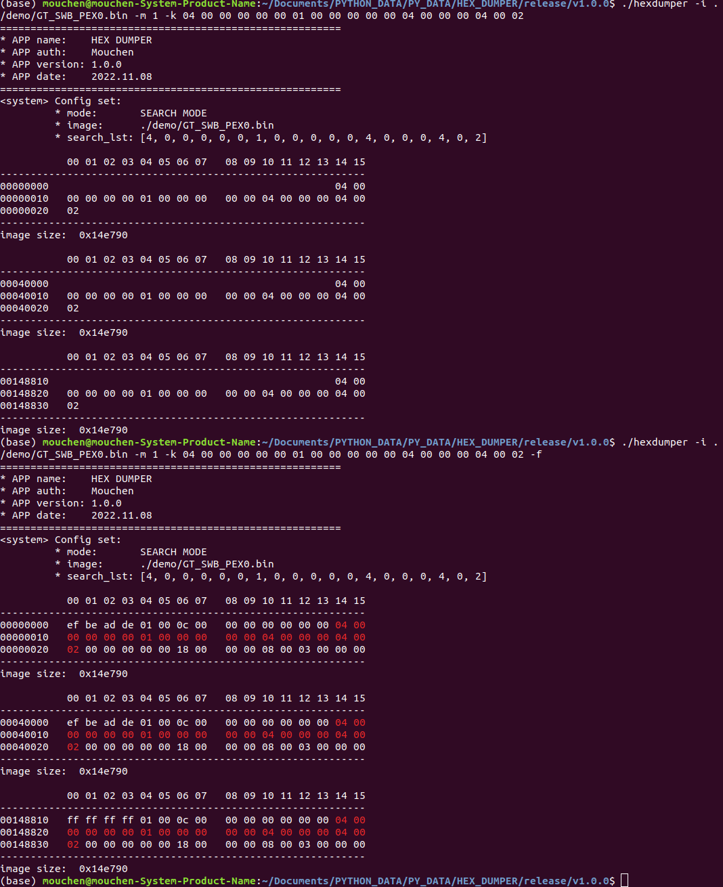
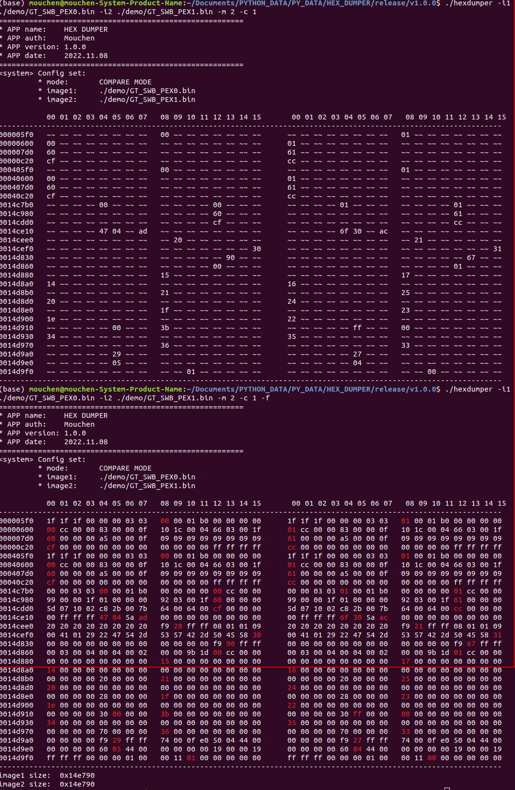

# HEXDUMPER
Hex file explore tool.

### Purpose:
    Create a tool for hex files explore.
    - STANDARD MODE: Given certain offset and numbers to display image.
    - SEARCH MODE: Given search key list of bytes to explore in 1 image. 
    - COMPARE MDOE: Given 2 images for comparing same/diff elements or even display all.

### First rlease date:
    2022.11.08

### Version:
- 1.0.0 - First commit - 2022/11/08
  - Feature: none
  - Bug: none

### Required:
- OS
  - Linux: support
  - Windows: support
- Enviroment
  - python(version requirement not sure yet!)

### Usage
- Help
  - **i1/i**:  Image1 path
  - **i2**:    Image2 path
  - **m**:     Selet mode.\
          - [0] STANDARD_MODE\
          - [1] SEARCH_MODE\
          - [2] COMPARE_MODE\
          note: Default is STANDARD_MODE
  - **k**:     Hex list in SEARCH_MODE\
        note: Only work in SEARCH_MODE
  - **s**:      Display offset\
        note: Only work in STANDARD_MODE
  - **n**:      Display numbers of bytes\
        note: Only work in STANDARD_MODE
  - **f**:      Force to print all element\
        note: Only work in SEARCH_MODE/COMPARE_MODE and only support in LINUX
  - **c**:      Choose sub mode\
        note: Only work in COMPARE_MODE, default 0\
          * COMPARE_MODE\
            - [0] no filter (default)\
            - [1] find different\
            - [2] find same

- **EX1. STANDARD MODE**\

- **EX2. SEARCH MODE**\

- **EX3. COMPARE MODE**\

### Note
- 1: Force display with color only supported in Linux. 
